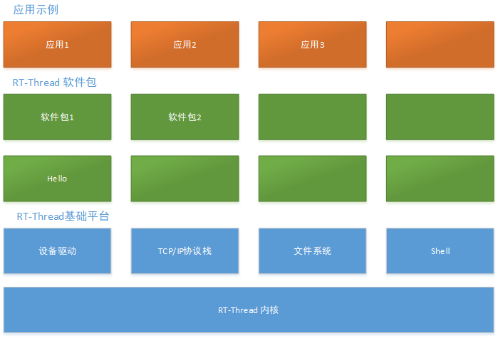

# hello 介绍

> 说明：你需要在这里对 hello 软件进行简单的介绍，描述背景、功能特点等等……

## 软件架构

> 简单介绍

### 软件架构图

如上 hello 软件架构图所示, 共分为 x 层，……，每一层描述。

## hello 功能特点

### 加密

rt_ota 固件加密方式采用了 AES256。

AES是高级加密标准Advanced Encryption Standard的缩写，是美国联邦政府采用的一种分组加密标准，也是目前分组密码实际上的工业标准。

TinyCrypt 是一种快速，简单的加密工具，用在文件安全的高级加密，并且使用快速的LZO来进行文件压缩。

- 为什么要对固件加密，多说说不加密的缺点
- 说明 AES256 加密算法特点、优势
- 开启加密后的 ROM 增大的体积

### 压缩

- 常见压缩算法的介绍，quicklz, fastlz, miniLZO
- 压缩率的统计对比
- 我们支持的压缩算法，未来将会支持另外两个
- 开启压缩后 ROM 增大的体积

### 防纂改

- 为什么会有防篡改功能（可以介绍下：固件都放在云平台，不安全；产品进行 OTA 升级时，固件可能会被截获，然后进行破解等等）
- 强调 RT_OTA 的防篡改功能优势：默认集成了防篡改功能，检查速度快，哪怕修改了 1 个 bit 都会检测出来等等

### 差分升级

- 查分升级 FOTA 的基本概念，1、APP 与 OS bin 分离，2、根据版本差异生成差分包
- 差分升级的优势，减少流量成本，APP 开发与 OS 分离
- RT_OTA 即将支持该功能

### 断电保护

- 多强调可靠性，避免客户 OTA 时掉电后变砖
- 该功能需要结合 Bootloader 实现，RT-Thread 能够提供专业化的保护策略

### 智能还原

- 多强调可靠性，避免升级后的固件，在使用过程中损坏，永久不变砖
- 该功能需要结合 Bootloader 实现，RT-Thread 能够提供专业化的技术指导
